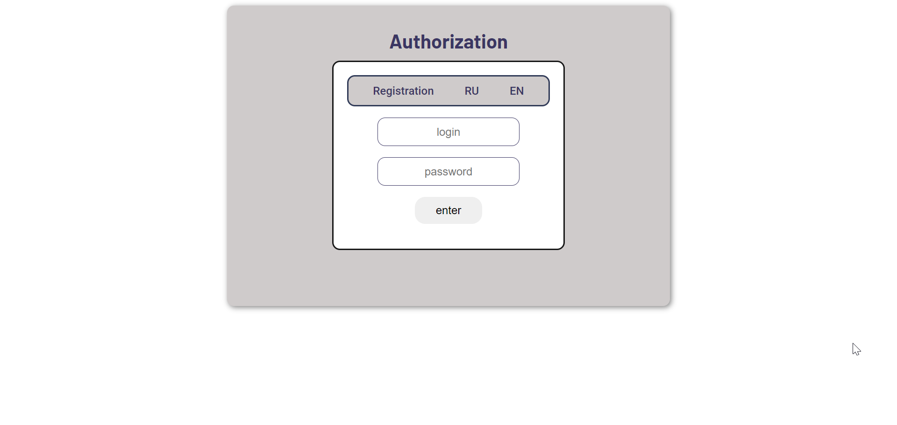

# ISPSystem

Адміністратор реєструє Абонента в системі.
Абоненту надано перелік Послуг (Телефон, Інтернет, Кабельне ТБ, IP-TV  тощо) і список Тарифів до кожної послуги.
Реалізувати можливість скачування тарифних планів в одному з форматів (наприклад, txt, pdf, docx).
Для переліку тарифів реалізувати можливість сортування за:
- алфавітом/в зворотньому порядку (a-z, z-a);
- за ціною.
  Абонент може обрати одну або кілька послуг за певним тарифом.
  У абонента є Рахунок, який він може поповнити.
  Кошти з рахунку знімаються системою в залежності від обраних абонентом тарифних планів.
  Якщо суми на рахунку не достатньо, система блокує користувача.
  Користувач автоматично розблокується по внесенню необхідної суми на рахунок.
  Адміністратор системи володіє правами:
- додавання, видалення або редагування тарифного плану;
- реєстрації, блокування та розблокування користувача.

### For successfully execute the program you should have:
1. [JDK 10.0.2](https://www.oracle.com/java/technologies/java-archive-javase10-downloads.html) or upper of date.

### Execution

1. You need [download](https://www.postgresql.org/download/) and install PostgreSQL.
   
2. Then [download]() TomCat 9.0.41 and store in any place on your computer.
   
3. Configure TomCat in IDE as start web service.
   
- When configure TomCat in Deployment tab on "Application context" will be "/".

P.S. If you use community Intellij IDEA:
- Setup tomcat on your computer
- Run Intellij and navigate to : File -> Settings -> Plugins
- Search for and install ‘smart tomcat’ from the marketplace (restart Intellij IDEA if prompted)
- Edit run/debug configurations. Add a new configuration of type ‘smart tomcat’ (by clicking on the ‘+’ button). Name the configuration.
- To add a tomcat server : Configuration -> ‘+’ -> Select the path to the local tomcat folder -> apply
- tomcat server -> select from the dropdown
- deployment -> pathToProject/ISPSystem/src/main/webapp
- Context path -> /
- Configure the ports as required
- Configure the steps to be run before launch. Ex: ‘run maven goal’ -> mvn clean install on C:\ISPSystem
- Apply and save

4. Restore database from ISPSystem/src/main/resources/DBBackup/ISPManagerBackup file.

- Your database owner will be "postgres" wih password "postgres".
- In pgAdmin create database with "ISPManager" name.
- Right click on database and choose "Restore".
- Format => Custom or tar.
- Filename => choose ISPManagerBackup from explorer.
- Role name => postgres.
- Click "Restore" button.
   
   
5. Start project with TomCat.

6. You will see that project was deployed. Then is going to open browser page like (image1).

7. Project is running.

### For successfully pass the tests you should have JUnit 5.x.x. and Mockito:
1. [Download JUnit from GitHub](https://github.com/junit-team/junit5/) or use Maven dependency:
    [JUnit Jupiter](https://mvnrepository.com/artifact/org.junit.jupiter/junit-jupiter-api)
    [JUnit Platform](https://mvnrepository.com/artifact/org.junit.platform/junit-platform-launcher)
    [JUnit Vintage](https://mvnrepository.com/artifact/org.junit.vintage/junit-vintage-engine)
2. [Mockito](https://mvnrepository.com/artifact/org.mockito/mockito-all).

### Program output image:

image1:

